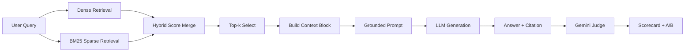

# Architecture - RAG Pipeline (Day 08 Lab)

## 1. Tổng quan kiến trúc

```text
[Raw Docs]
    ->
[index.py: Preprocess -> Chunk -> Embed -> Store]
    ->
[ChromaDB Vector Store]
    ->
[rag_answer.py: Query -> Retrieve -> Generate]
    ->
[Grounded Answer + Citation]
    ->
[eval.py: LLM-as-Judge + Scorecard + A/B]
```

Hệ thống này là trợ lý nội bộ cho khối CS + IT Helpdesk. Mục tiêu là trả lời các câu hỏi về chính sách, SLA, access control và HR policy bằng bằng chứng retrieve được từ tài liệu nội bộ, có citation và có khả năng abstain khi không đủ context.

## 2. Indexing Pipeline (Sprint 1)

### Tài liệu được index

| File | Nguồn | Department | Số chunk |
|------|-------|------------|----------|
| `policy_refund_v4.txt` | `policy/refund-v4.pdf` | CS | 6 |
| `sla_p1_2026.txt` | `support/sla-p1-2026.pdf` | IT | 5 |
| `access_control_sop.txt` | `it/access-control-sop.md` | IT Security | 8 |
| `it_helpdesk_faq.txt` | `support/helpdesk-faq.md` | IT | 6 |
| `hr_leave_policy.txt` | `hr/leave-policy-2026.pdf` | HR | 5 |

Tổng số chunk trong collection `rag_lab`: `30`.

### Quyết định chunking

| Tham số | Giá trị | Lý do |
|---------|---------|-------|
| Chunk size | `400`  | Đủ lớn để giữ trọn một đoạn/chính sách, nhưng vẫn gọn cho retrieval |
| Overlap | `80`  | Giảm nguy cơ cắt giữa ý quan trọng |
| Chunking strategy | Heading-based -> split by size | Ưu tiên cắt theo `=== ... ===`, chỉ chia nhỏ thêm khi section quá dài |
| Metadata fields | `source`, `section`, `effective_date`, `department`, `access` | Phục vụ citation, freshness, debugging và filter |

### Embedding model

- Model: `text-embedding-3-small`
- Provider: `openai`
- Vector store: `chromadb.PersistentClient`
- Similarity metric: `cosine`

## 3. Retrieval Pipeline (Sprint 2 + 3)

### Baseline (Sprint 2)

| Tham số | Giá trị |
|---------|---------|
| Strategy | Dense retrieval trên ChromaDB |
| Top-k search | `10` |
| Top-k select | `3` |
| Rerank | `False` |
| Min relevance score | `0.35` |

### Variant đã thử trong Sprint 3

| Tham số | Giá trị | Thay đổi so với baseline |
|---------|---------|--------------------------|
| Strategy | `hybrid` | Thêm BM25 sparse score |
| Dense weight | `0.6` | Mới |
| Sparse weight | `0.4` | Mới |
| Top-k search | `10` | Giữ nguyên |
| Top-k select | `3` | Giữ nguyên |
| Rerank | `False` | Giữ nguyên để tuân thủ A/B rule |

### Lý do chọn hybrid

Corpus vừa có ngôn ngữ tự nhiên như policy và quy trình, vừa có alias/keyword như `Approval Matrix`, `Level 3`, `P1`, `ERR-403-AUTH`. Vì vậy, variant được chọn để test là hybrid dense + BM25, với kỳ vọng sparse sẽ giúp các query alias/keyword mà dense có thể bỏ sót.

### Kết quả A/B

| Metric | Baseline | Variant Hybrid | Delta |
|--------|----------|----------------|-------|
| Faithfulness | `5.00/5` | `5.00/5` | `+0.00` |
| Relevance | `5.00/5` | `5.00/5` | `+0.00` |
| Context Recall | `5.00/5` | `5.00/5` | `+0.00` |
| Completeness | `4.50/5` | `4.30/5` | `-0.20` |

Kết luận: hybrid chạy end-to-end thành công nhưng **không tốt hơn baseline** trên test set hiện tại. Query `q06` bị sparse kéo lệch sang chunk "Escalation" trong `access-control-sop.md`, làm giảm completeness. Cấu hình được đề xuất giữ lại để demo/benchmark là `baseline_dense`.

## 4. Generation (Sprint 2)

### Grounded prompt

Prompt có các ràng buộc sau:

- Chỉ được trả lời từ context retrieve.
- Nếu context không đủ, phải trả về đúng câu abstain.
- Cần citation dạng `[1]`, `[2]`.
- Giữ câu trả lời ngắn, factual và cùng ngôn ngữ với query.

### LLM configuration

| Tham số | Giá trị |
|---------|---------|
| Generation provider | `openai` |
| Generation model | `gpt-4o-mini` |
| Temperature | `0` |
| Max tokens | `512` |

## 5. Evaluation (Sprint 4)

`eval.py` chấm 10 test questions với 4 metric:

- `faithfulness`: Gemini judge kiểm tra answer có bám retrieved context hay không.
- `relevance`: Gemini judge kiểm tra answer có trả lời đúng câu hỏi hay không.
- `context_recall`: deterministic check trên `expected_sources`.
- `completeness`: Gemini judge kiểm tra các ý chính trong expected answer có đủ hay không.

Judge config:

- Judge model: `gemini-2.5-flash-lite`
- Output format: JSON
- Có retry/backoff khi gặp `429`, `500`, `503`
- Có local cache tại `results/judge_cache.json` để resume khi API bị giật

Artifacts tạo ra:

- `results/scorecard_baseline.md`
- `results/scorecard_variant.md`
- `results/ab_summary.md`
- `results/ab_comparison.csv`

## 6. Failure Mode Checklist

| Failure Mode | Triệu chứng | Cách kiểm tra |
|-------------|-------------|---------------|
| Index lỗi | Retrieve ra sai doc hoặc metadata thiếu | `python index.py` -> `list_chunks()` + `inspect_metadata_coverage()` |
| Chunking tệ | Chunk bị cắt giữa điều khoản | Xem preview chunk trong `index.py` |
| Sparse lexical overfit | Query có từ khóa trùng section khác domain, hybrid bị lệch | So sánh `dense` vs `hybrid` cho `q06` |
| Generation thiếu chi tiết | Answer đúng doc nhưng thiếu current document name / exception | Xem điểm `completeness` trong scorecard |
| Judge API không ổn định | Eval đang dở giữa chừng vì `503 UNAVAILABLE` | Judge cache + retry/backoff trong `eval.py` |

## 7. Diagram


