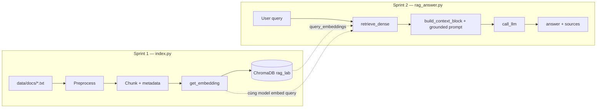

# Kiến trúc RAG & triển khai — Sprint 1 & 2

Tài liệu ngắn gọn cho Lab Day 08: phạm vi **chỉ indexing + baseline retrieval/generation** (chưa hybrid/rerank/eval).

---

## 1. RAG là gì (trong lab này)

**Retrieval-Augmented Generation:** không chỉ dựa vào kiến thức sẵn có của LLM; hệ thống **tìm đoạn văn bản liên quan** trong kho tài liệu nội bộ (đã được **index** thành vector), **đưa các đoạn đó vào prompt**, rồi LLM **trả lời dựa trên ngữ cảnh** và trích dẫn nguồn.

- **Sprint 1:** biến tài liệu thô → chunk có metadata → embedding → lưu **ChromaDB**.
- **Sprint 2:** câu hỏi → embedding cùng model → **dense search** → chọn top chunk → **prompt grounded** → LLM → câu trả lời + `sources`.

---

## 2. Sơ đồ tổng thể (Sprint 1 → 2)



---

## 3. Sprint 1 — Kiến trúc indexing

| Bước | Hàm / thành phần | Vai trò |
|------|------------------|---------|
| 1 | `preprocess_document()` | Đọc header (`Source`, `Department`, `Effective Date`, `Access`), gắn metadata tài liệu, làm sạch body. |
| 2 | `chunk_document()` + `_split_by_size()` | Chia theo heading `=== ... ===`, sau đó giới hạn độ dài (~`CHUNK_SIZE`×4 ký tự) + overlap (`CHUNK_OVERLAP`×4). Mỗi chunk có `section` riêng + metadata gốc (xem mục dưới). |
| 3 | `get_embedding()` | Vector hóa **nội dung chunk** (OpenAI `text-embedding-3-small` **hoặc** Sentence Transformers local). |
| 4 | `build_index()` | Persistent ChromaDB tại `chroma_db/`, collection `rag_lab`, metric **cosine**; `upsert` id, embedding, `documents`, `metadatas`. |
| 5 | `list_chunks()` / `inspect_metadata_coverage()` | Kiểm tra chunk, metadata (`source`, `section`, `effective_date`, …). |

**Nguyên tắc:** embedding query (Sprint 2) **phải cùng model/kích thước vector** với embedding lúc index.

### 3.1 Metadata của chunk (lưu trong Chroma `metadatas`)

Mỗi chunk có **cùng một bộ khóa**; giá trị phụ thuộc file nguồn và section chứa nội dung chunk.

**Mẫu metadata tối thiểu** (đúng 5 khóa; giá trị minh họa như slide lab — trong code/Chroma mọi giá trị nên là chuỗi):

```python
metadata = {
    "source": "policy/refund-v4.pdf",
    "section": "Điều 3",
    "department": "CS",
    "effective_date": "2026-02-01",
    "access": "internal",
}
```

Với corpus thực trong `data/docs/`, `section` lấy từ heading `=== Section … ===` / `=== Phần … ===` thay cho `Điều 3`; các khóa còn lại vẫn cùng ý nghĩa.

| Khóa | Cấp | Nguồn | Ý nghĩa / ví dụ từ corpus lab |
|------|-----|--------|--------------------------------|
| `source` | Tài liệu | Dòng `Source:` trong header | Định danh bản gốc: `it/access-control-sop.md` ([`access_control_sop.txt`](../data/docs/access_control_sop.txt)), `hr/leave-policy-2026.pdf` ([`hr_leave_policy.txt`](../data/docs/hr_leave_policy.txt)). |
| `department` | Tài liệu | Dòng `Department:` | Bộ phận sở hữu: `IT Security`, `HR`. |
| `effective_date` | Tài liệu | Dòng `Effective Date:` | Ngày hiệu lực (chuỗi): `2026-01-01` — hai file mẫu trùng giá trị. |
| `access` | Tài liệu | Dòng `Access:` | Mức độ tiết lộ: `internal` (cả hai SOP/policy mẫu). |
| `section` | Chunk | Tiêu đề dòng `=== ... ===` ngay trước đoạn được cắt | Phạm vi nội dung trong chunk, ví dụ `Section 2: Phân cấp quyền truy cập`, `Phần 2: Quy trình xin nghỉ phép`. Nếu một section quá dài và bị `_split_by_size()` tách thành nhiều chunk, **mọi phần đó vẫn giữ cùng `section`**. |

**Không** đưa vào `metadatas` (theo thiết kế Sprint 1–2 hiện tại): dòng tiêu đề in hoa đầu file (ví dụ *QUY TRÌNH KIỂM SOÁT…* / *CHÍNH SÁCH NGHỈ PHÉP…*) — chỉ dùng để đọc người, không lưu thành field riêng; **id** vector store dùng `{tên_file_không_đuôi}_{index}` (ví dụ `access_control_sop_0`) là **khóa upsert**, không trùng với dict metadata.

**Gộp lại:** mỗi chunk có **5 field** — bốn field cấp tài liệu (`source`, `department`, `effective_date`, `access`) + một field cấp chunk (`section`). Đáp ứng DoD “≥ 3 metadata hữu ích” và đủ để citation trong prompt (`source` + `section`).

**Definition of Done (rút gọn):** đủ 5 file trong `data/docs/`; mỗi chunk có đủ 5 khóa trên (không thiếu `section` sau khi chunk); `list_chunks()` cho preview hợp lý.

---

## 4. Sprint 2 — Kiến trúc RAG baseline

| Bước | Hàm | Vai trò |
|------|-----|---------|
| 1 | `retrieve_dense()` | `get_embedding(query)` → `collection.query(..., n_results=TOP_K_SEARCH)` → map `distances` → **score** (ví dụ cosine: `1 - distance`). Trả về list `{text, metadata, score}`. |
| 2 | (trong `rag_answer`) | Lấy `top_k_select` chunk đầu (hoặc sau rerank — Sprint 3). |
| 3 | `build_context_block()` | Đánh số `[1]`, `[2]`, … kèm `source`, `section`, `score`. |
| 4 | `build_grounded_prompt()` | Quy tắc: chỉ từ context, thiếu dữ liệu thì **abstain**, có citation, ngắn gọn, cùng ngôn ngữ câu hỏi. |
| 5 | `call_llm()` | OpenAI Chat (`temperature=0`, `max_tokens=512`) **hoặc** Gemini; đọc model từ `LLM_MODEL` / env. |
| 6 | `rag_answer()` | Nối pipeline, trả về `answer`, `sources`, `chunks_used`, `config`. |

**Tham số mặc định trong code:** `TOP_K_SEARCH = 10`, `TOP_K_SELECT = 3`.

**Definition of Done (rút gọn):** câu có trong docs → trả lời có `[1]`; câu ngoài corpus (ví dụ `ERR-403-AUTH`) → **Không đủ dữ liệu** / không bịa; `sources` không rỗng khi có chunk dùng.

---

## 5. Triển khai ngắn gọn (checklist)

### Sprint 1

1. `pip install -r requirements.txt` + `.env` (API key nếu dùng OpenAI embed).
2. Implement `get_embedding()` (một lựa chọn: cloud hoặc local).
3. Trong `build_index()`: bỏ comment — gọi `preprocess_document` → `chunk_document` → vòng lặp `get_embedding` + `collection.upsert`.
4. Uncomment `build_index()` / `list_chunks()` trong `if __name__ == "__main__"` khi đã xong.
5. Chạy: `python index.py` (full build), sau đó kiểm tra `list_chunks()`.

### Sprint 2

1. `retrieve_dense()`: import `get_embedding`, `CHROMA_DB_DIR`, mở collection `rag_lab`, `query` với `query_embeddings`.
2. `call_llm()`: một provider, `temperature=0`.
3. Chạy `python rag_answer.py` với các câu mẫu trong `__main__` (và/hoặc `data/test_questions.json`).
4. Verify citation + abstain + `sources`.

---

## 6. Liên kết file code

| Sprint | File | Điểm mở rộng sau này |
|--------|------|----------------------|
| 1 | `index.py` | Cải thiện `_split_by_size()` theo đoạn văn (`\n\n`) để tránh cắt giữa điều khoản. |
| 2 | `rag_answer.py` | Sprint 3: `retrieve_hybrid`, `rerank`, `transform_query`, `compare_retrieval_strategies`. |

Bản mở rộng đầy đủ pipeline (Sprint 3–4, failure modes, diagram đầy đủ): xem [`architecture.md`](./architecture.md).
